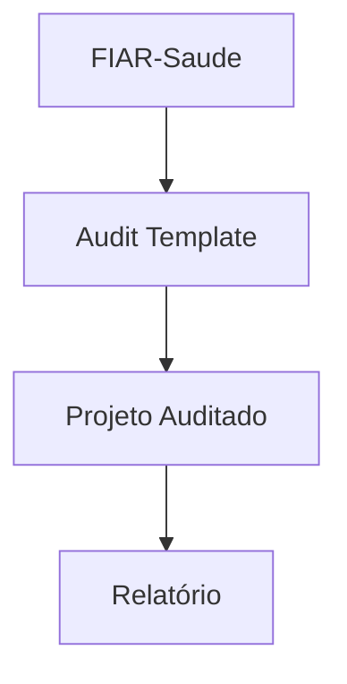
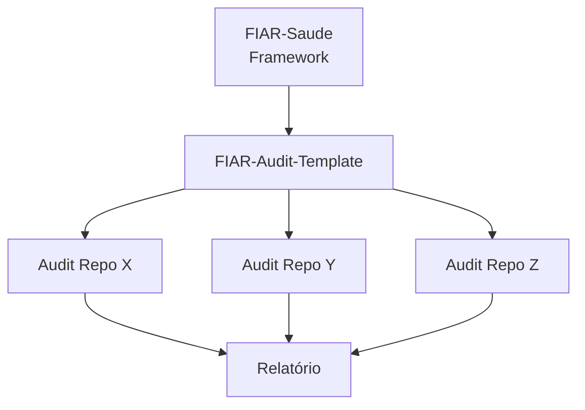
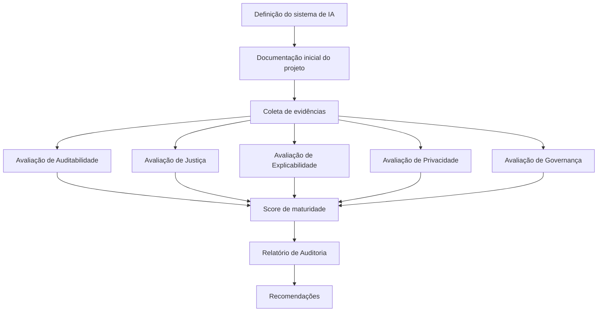

# FIAR - Documento Completo


----------------------------------------
# README
----------------------------------------

# FIAR Saúde – Framework de Auditoria de IA Responsável


O FIAR Saúde é um framework para auditoria de sistemas de inteligência artificial que transforma princípios de IA Responsável em **critérios verificáveis, evidências documentadas e níveis de maturidade auditáveis**, no contexto da saúde pública.

---

## Como funciona?

O FIAR estrutura a auditoria de sistemas de IA como um ecossistema composto por duas camadas complementares:

* **Metodologia** (este repositório)
* **Execução** (template de auditoria)

Para auditar um sistema, utilize o template:

👉 [FIAR Audit Template](https://github.com/marisavas/FIAR-Audit-Template)



A avaliação é realizada por meio de um checklist estruturado, que conecta evidências documentadas a critérios verificáveis e níveis de maturidade.

---

## Dimensões de Avaliação (IAR)

O FIAR operacionaliza a IA Responsável por meio de cinco dimensões críticas:

- **Auditabilidade**: Rastreabilidade do ciclo de vida de dados e modelos (logs, versionamento e controle de acesso)
- **Explicabilidade**: Capacidade de fornecer interpretações compreensíveis para decisões clínicas ou administrativas
- **Justiça**: Detecção e mitigação de vieses em subgrupos demográficos (por exemplo, cor/raça, gênero, região)
- **Privacidade**: Garantia de anonimização e conformidade com a LGPD e normativas do CNS
- **Governança**: Estruturas de decisão, gestão de riscos e alinhamento com comitês de ética (CEP/CONEP)

> As dimensões apresentadas correspondem à **camada técnica da auditoria**.
> A relação com as dimensões institucionais do modelo de maturidade está detalhada em `docs/dimensoes_avaliacao.md`.

---

## Níveis de Maturidade

O FIAR classifica o estágio de cada projeto em uma escala progressiva de maturidade:

| Nível       | Estágio               | Descrição                                              |
| ------------ | ---------------------- | -------------------------------------------------------- |
| **L1** | **Ad-hoc**       | Práticas informais e não padronizadas                  |
| **L2** | **Inicial**      | Documentação básica disponível                       |
| **L3** | **Desenvolvido** | Testes técnicos realizados com evidências documentadas |
| **L4** | **Consolidado**  | Monitoramento contínuo e governança integrada          |

---

## Motivação

Frameworks de Responsible AI frequentemente definem princípios éticos, mas oferecem orientação limitada sobre a sua implementação prática.

O FIAR propõe uma abordagem operacional baseada em:

* documentação estruturada do sistema
* evidências verificáveis
* avaliação sistemática por dimensões de Responsible AI
* geração de relatórios de auditoria

O framework distingue **artefatos produzidos pelo projeto** de **avaliações independentes conduzidas pelo auditor**, permitindo auditorias mais estruturadas, transparentes e verificáveis.

---

## Diferenciais do FIAR

O FIAR se diferencia de outros frameworks de IA Responsável por:

- operacionalizar princípios éticos em **checklists verificáveis**
- separar explicitamente **projeto e auditoria independente**
- utilizar **evidências documentadas como base da avaliação**
- adotar um **modelo de maturidade progressivo e cumulativo**
- permitir **reprodutibilidade e rastreabilidade** das auditorias

Essa abordagem reduz a subjetividade e aumenta a consistência das avaliações.

---

## Arquitetura do Framework

O ecossistema FIAR é composto por três elementos principais:

1. **FIAR-Saude** - Documentação conceitual e metodologia
2. **FIAR-Audit-Template** - Estrutura para execução das auditorias
3. **Repositórios de auditoria** – Instâncias específicas para cada sistema avaliado



Cada auditoria deve ser conduzida em um **repositório próprio criado a partir do template**.

---

## Documentação Completa

Para detalhes metodológicos:

- Metodologia → [docs/metodologia_fiar.md](docs/metodologia_fiar.md)
- Ciclo de Auditoria → [docs/ciclo_auditoria.md](docs/ciclo_auditoria.md) 
- Dimensões → [docs/dimensoes_avaliacao.md](docs/dimensoes_avaliacao.md)
- Governança → [docs/governanca_auditoria.md](docs/governanca_auditoria.md)

---

## Estrutura do Repositório

```
FIAR-Saude/
├── docs/                       # Detalhamento técnico
│   ├── metodologia_fiar.md     # Fases 1 (Exploratória) e 2 (Sistemática)
│   ├── dimensoes_avaliacao.md  # Critérios e sub-indicadores
│   ├── ciclo_auditoria.md      # Fluxo passo a passo
│   └── governanca_auditoria.md # Papéis e responsabilidades
├── README.md
├── LICENSE
└── CITATION.cff

```

Este repositório contém a **documentação conceitual do framework**. A execução das auditorias deve ser realizada por meio do template.

---

## Exemplo

Um exemplo completo de aplicação do FIAR está disponível em:

👉 [Acessar Toy Example](https://github.com/fiar-audit-toy-example)

Inclui:

* documentação do sistema
* artefatos técnicos
* avaliação estruturada
* relatório final

---

## Quickstart

Para auditar um sistema utilizando o FIAR:

1. Crie um repositório a partir do template
2. Documente o sistema (descrição, contexto, limitações)
3. Adicione artefatos técnicos (Model Card, Data Card, métricas, logs)
4. Avalie o sistema utilizando o checklist FIAR
5. Consolide os resultados por dimensão
6. Gere o relatório de maturidade com recomendações

---

## Público-alvo

O FIAR foi desenvolvido para:

* pesquisadores em IA aplicada à saúde
* equipes de ciência de dados em instituições públicas
* projetos que desejam estruturar práticas de Responsible AI

---

## Status do Projeto

Este framework está em desenvolvimento e validação em projetos de IA em saúde pública no contexto do CIIA-Saúde.


---

## Referência e Citação

Se você utilizar o FIAR em pesquisas ou projetos, cite:

Vasconcelos et al. (2026). *FIAR Saúde – Responsible AI Audit Framework for Public Health Systems.*

---

## Contribuições

Contribuições para o framework são bem-vindas.

---

## Licença

MIT License


----------------------------------------
# Metodologia FIAR
----------------------------------------

# Metodologia do Framework FIAR

## Objetivo do framework

O FIAR (Framework de Auditoria de IA Responsável) foi desenvolvido para apoiar a **documentação, avaliação e auditoria** de sistemas de inteligência artificial aplicados à saúde pública.

Seu objetivo é transformar princípios de IA Responsável em **controles verificáveis**, baseados em evidências documentadas e avaliados por meio de dimensões estruturadas.

O framework busca reduzir a distância entre **princípios normativos de ética em IA** e **práticas operacionais de governança e auditoria** de sistemas de IA.

Essa abordagem está alinhada a diretrizes internacionais de IA Responsável, como os princípios da OECD para IA, recomendações da Organização Mundial da Saúde (OMS) para sistemas de IA em saúde e normas de gestão de risco em IA propostas pela ISO/IEC.

---

## Princípios do framework

O FIAR baseia-se em quatro princípios metodológicos:

### Documentação estruturada

Sistemas de IA devem possuir documentação clara sobre contexto, dados utilizados, arquitetura do modelo e finalidade.

### Evidências verificáveis

A avaliação de IA Responsável deve ser baseada em evidências documentadas, como artefatos técnicos e registros do sistema.

### Separação entre projeto e auditoria

O framework estabelece uma distinção entre:

* **artefatos produzidos pelo projeto**
* **avaliações conduzidas por auditores independentes** 

O projeto não avalia a si próprio, sendo responsável por fornecer evidências que serão analisadas por auditor independente.

### Avaliação multidimensional

A auditoria considera múltiplas dimensões de IA Responsável, refletindo diferentes categorias de risco.

No FIAR, essas dimensões incluem:

* auditabilidade
* explicabilidade
* justiça
* privacidade
* governança

---

## Estrutura da auditoria

A auditoria utilizando o FIAR é organizada em três componentes principais:

1. **Documentação do sistema de IA**
2. **Artefatos técnicos produzidos pelo projeto**
3. **Avaliação independente conduzida pelo auditor**

A documentação e os artefatos são produzidos pela equipe responsável pelo sistema de IA, enquanto a avaliação é conduzida com base em critérios definidos pelo framework.

---

## Evidências e artefatos

A auditoria FIAR baseia-se na análise de evidências documentadas fornecidas pelo projeto.

Entre os principais artefatos estão:

* documentação inicial do sistema
* Data Cards
* Model Cards
* relatórios técnicos
* documentação de governança

Esses artefatos permitem registrar informações relevantes, como:

* fontes de dados
* decisões de modelagem
* limitações do sistema
* potenciais impactos

---

## Avaliação de maturidade

O FIAR avalia o grau de maturidade do sistema em cada dimensão de IA Responsável.

Cada dimensão é analisada com base:

* nas evidências fornecidas pelo projeto
* nos critérios definidos pelo framework

A avaliação considera:

* nível de documentação existente
* presença de práticas de mitigação de riscos
* mecanismos de transparência
* práticas institucionais de governança

Os resultados são expressos por níveis de maturidade (L1-L4), acompanhados de justificativas documentadas.

--- 

## Resultado da auditoria

O processo de auditoria resulta na produção de um **relatório de auditoria**, que inclui:

* avaliação por dimensão
* evidências analisadas
* justificativas das avaliações
* recomendações para melhoria

O relatório apoia processos de **governança, transparência e melhoria contínua**.

---

## Implementação do framework

O FIAR é operacionalizado por meio de um template estruturado:

👉 https://github.com/marisavas/FIAR-Audit-Template

O template fornece suporte para:

* documentação do sistema
* organização de artefatos
* registro das avaliações
* estruturação do relatório final

Cada auditoria deve ser conduzida em um **repositório próprio criado a partir do template**, garantindo padronização e rastreabilidade.

---

## Arquitetura conceitual do framework

O FIAR distingue entre:

- **camada técnica** (avaliação por dimensões)
- **camada institucional** (maturidade e governança)

As dimensões técnicas fornecem evidências para a avaliação institucional do sistema.

## Relação com o processo de auditoria

A operacionalização da metodologia descrita neste documento é detalhada em:

→ [Ciclo de Auditoria](ciclo_auditoria.md)

Para critérios de avaliação por dimensão, consulte:

→ [Dimensões de Avaliação](dimensoes_avaliacao.md)

----------------------------------------
# Ciclo de Auditoria
----------------------------------------

# Ciclo de Auditoria do FIAR

A auditoria de sistemas de inteligência artificial utilizando o FIAR segue um processo estruturado baseado na análise de evidências documentadas.

O ciclo de auditoria foi projetado para garantir **transparência, rastreabilidade e avaliação sistemática** de práticas de IA Responsável.

---

## Etapa 1 – Definição do sistema de IA

A auditoria inicia-se com a definição do sistema de IA a ser avaliado.

Nesta etapa são estabelecidos:

* objetivo do sistema
* contexto de aplicação
* escopo da auditoria
* equipe responsável pelo projeto

Essa definição delimita o escopo da avaliação e permite identificar riscos iniciais associados ao sistema.

---

## Etapa 2 – Documentação inicial do projeto

A equipe responsável pelo sistema de IA produz uma documentação inicial contendo informações relevantes sobre o projeto.

Essa documentação inclui, quando disponível:

* descrição do sistema
* contexto de aplicação
* fontes de dados
* arquitetura do modelo
* limitações conhecidas

Essa etapa fornece o contexto necessário para a condução da auditoria.

---

## Etapa 3 – Produção de artefatos técnicos

O projeto produz artefatos técnicos que documentam aspectos específicos do sistema de IA.

Entre os principais artefatos estão:

* **Data Cards**, descrevendo características dos dados utilizados
* **Model Cards**, documentando propriedades do modelo
* **Relatórios técnicos**, descrevendo avaliações realizadas pelo projeto

Esses artefatos constituem a base de evidências para a avaliação.

---

## Etapa 4 – Coleta e organização de evidências

O auditor analisa a documentação e os artefatos produzidos pelo projeto.

Essa etapa envolve:

* revisão da documentação do sistema
* análise de artefatos técnicos
* mapeamento das evidências às dimensões de avaliação

A coleta e organização de evidências estruturam a base analítica da auditoria.

---

## Etapa 5 – Avaliação

O auditor conduz a avaliação do sistema com base nas dimensões definidas pelo FIAR:

* auditabilidade
* explicabilidade
* justiça
* privacidade
* governança

A avaliação é operacionalizada por meio de um **checklist estruturado**, que associa:

- dimensões de IA Responsável
- critérios verificáveis
- evidências documentadas

Cada item do checklist é classificado como:

- presente
- parcial
- ausente

Os resultados são agregados por dimensão e utilizados para determinar o nível de maturidade do sistema (L1–L4).

Para critérios detalhados por dimensão, consulte:

→ [Dimensões de Avaliação](dimensoes_avaliacao.md)

---

## Etapa 6 – Relatório de auditoria

Ao final do processo, o auditor produz um relatório estruturado contendo:

* avaliação por dimensão
* evidências analisadas
* justificativas da avaliação
* recomendações para melhoria

O relatório tem como objetivo apoiar **governança, transparência e melhoria contínua** de sistemas de IA.

---

## Representação do Ciclo de Auditoria



---

## Síntese do Processo

O fluxo apresentado pode ser consolidado em três fases principais, que estruturam a auditoria de forma progressiva:

1. **Documentação do sistema**

2. **Avaliação por dimensões de IA Responsável**

3. **Relatório de auditoria e recomendações**

Essa síntese apresenta o ciclo de auditoria em um nível mais abstrato, facilitando sua aplicação em diferentes contextos e tipos de sistema.

---

## Relação com a metodologia

O ciclo de auditoria operacionaliza os princípios definidos na metodologia do framework, especialmente no que se refere ao uso de evidências documentadas e à separação entre projeto e avaliação independente.

Para uma visão conceitual do framework, consulte:
→ [Metodologia do FIAR](metodologia_fiar.md)

Para o detalhamento dos critérios de avaliação por dimensão:
→ [Dimensões de IA Responsável](dimensoes_avaliacao.md)

Para documentação específica de cada dimensão: 
→ [Documentação detalhada por dimensão](avaliação/)

## 4. Hierarquia de navegação 

## Hierarquia de navegação

A documentação do FIAR está organizada em três níveis complementares:

1. **Metodologia** – visão conceitual do framework  
2. **Dimensões** – estrutura de avaliação  
3. **Avaliação** – critérios detalhados por dimensão  

Essa organização permite diferentes formas de navegação:

- Para uma visão conceitual do framework → consulte a metodologia  
- Para entender o que é avaliado → consulte as dimensões  
- Para critérios detalhados de avaliação → consulte a documentação de avaliação  


----------------------------------------
# Dimensões de Avaliação
----------------------------------------

# Dimensões de Avaliação do FIAR

O FIAR avalia sistemas de inteligência artificial a partir de cinco dimensões principais de IA Responsável.

Essas dimensões estruturam a avaliação de IA Responsável no framework, representando diferentes categorias de risco associadas ao uso de sistemas de IA em contextos de saúde pública.

Cada dimensão é avaliada com base em **evidências documentadas**, fornecidas pelo projeto e analisadas por um auditor independente.

A definição dessas dimensões foi inspirada em referências internacionais de IA Responsável, incluindo princípios da OECD, diretrizes da Organização Mundial da Saúde (OMS) para IA em saúde e normas de gestão de risco em IA (ISO/IEC 23894).

---

## 1. Auditabilidade

A dimensão de auditabilidade avalia se o sistema possui níveis adequados de documentação e rastreabilidade que permitam análise, verificação e reprodutibilidade.

Aspectos considerados incluem:

* documentação do sistema
* rastreabilidade de dados e modelos
* registro de decisões ao longo do desenvolvimento
* disponibilidade de artefatos técnicos

Para critérios detalhados de avaliação, consulte:
→ [Avaliação de Auditabilidade](avaliacao/auditabilidade.md)

---

## 2. Explicabilidade

A dimensão de explicabilidade avalia se o funcionamento do sistema e suas decisões podem ser compreendidos por públicos relevantes.

Aspectos considerados incluem:

* descrição do funcionamento do modelo
* justificativas para decisões automatizadas
* mecanismos de interpretação
* comunicação de limitações

Para critérios detalhados de avaliação, consulte:
→ [Avaliação de Explicabilidade](avaliacao/explicabilidade.md)

---

## 3. Justiça

A dimensão de justiça avalia potenciais impactos desiguais do sistema sobre diferentes grupos populacionais.

Aspectos considerados incluem:

* presença de vieses nos dados
* diferenças de desempenho entre subgrupos
* riscos de efeitos discriminatórios
* estratégias de mitigação de vieses

Para critérios detalhados de avaliação, consulte:
→ [Avaliação de Justiça](avaliacao/justica.md)

---

## 4. Privacidade

A dimensão de privacidade avalia como dados sensíveis são coletados, utilizados e protegidos ao longo do ciclo de vida do sistema.

Aspectos considerados incluem:

* origem e sensibilidade dos dados
* práticas de anonimização ou pseudonimização
* mecanismos de controle de acesso
* conformidade com legislações e políticas de proteção de dados

Para critérios detalhados de avaliação, consulte:
→ [Avaliação de Privacidade](avaliacao/privacidade.md)

---

## 5. Governança

A dimensão de governança avalia a existência de estruturas institucionais para supervisionar o desenvolvimento e o uso do sistema de IA.

Aspectos considerados incluem:

* definição de responsabilidades institucionais
* mecanismos de supervisão humana
* políticas de uso e operação do sistema
* processos de revisão, atualização e monitoramento

Para critérios detalhados de avaliação, consulte:
→ [Avaliação de Governança](avaliacao/governanca.md)

---

## Avaliação das Dimensões

A avaliação de cada dimensão é realizada com base nas evidências fornecidas pelo projeto e analisadas pelo auditor.

A análise considera:

* qualidade e completude da documentação
* presença de mecanismos de mitigação de riscos
* transparência das decisões técnicas
* maturidade das práticas institucionais

Os resultados são consolidados no **relatório final de auditoria**, juntamente com justificativas e recomendações para melhoria.

---

## Operacionalização da Avaliação (Checklist de Avaliação)

A avaliação operacional de cada dimensão é realizada por meio de checklists específicos, disponíveis na pasta:

→ [Checklists de Avaliação](checklist/)


Cada item do checklist:

* está associado a uma dimensão
* requer evidência documental ou técnica
* é avaliado segundo critérios padronizados (por exemplo: presente, parcial, ausente)

O checklist permite padronizar o processo de auditoria e garantir consistência entre avaliações.

---

## Documentação Complementar

Algumas dimensões possuem documentação metodológica específica, contendo:

* critérios detalhados de avaliação
* exemplos de evidências esperadas
* orientações para análise

Esses documentos são utilizados como suporte ao processo de auditoria.

---

## Critérios detalhados por dimensão

Os critérios operacionais de avaliação estão disponíveis em:

- [Auditabilidade](avaliacao/auditabilidade.md)
- [Justiça](avaliacao/justica.md)
- [Explicabilidade](avaliacao/explicabilidade.md)
- [Governança](avaliacao/governanca.md)
- [Privacidade](avaliacao/privacidade.md)


---

## Relação com a metodologia

As dimensões de IA Responsável representam a estrutura de avaliação definida pelo framework FIAR.

Para uma visão conceitual dos princípios do framework: 
→ [Metodologia do FIAR](metodologia_fiar.md)

Para o processo operacional de auditoria: 
→ [Ciclo de Auditoria](ciclo_auditoria.md)

Para critérios detalhados de avaliação por dimensão: 
→ [Documentação de Avaliação](avaliacao/)


----------------------------------------
# Avaliação de Auditabilidade
----------------------------------------

# Avaliação de Auditabilidade

A dimensão de auditabilidade no framework FIAR examina em que medida um sistema de inteligência artificial possui documentação, rastreabilidade e evidências suficientes para permitir análise, verificação e reprodutibilidade ao longo de seu ciclo de vida.

A auditabilidade é um requisito fundamental para a avaliação de sistemas de IA, pois possibilita a reconstrução de decisões técnicas e institucionais, além de sustentar práticas de transparência e governança.

Essa dimensão está alinhada a diretrizes internacionais de IA Responsável, incluindo princípios da OECD, recomendações da Organização Mundial da Saúde (OMS) e normas de gestão de risco em IA (como ISO/IEC 23894), que destacam a importância de documentação, rastreabilidade e prestação de contas.

---

## Objetivo da dimensão

A análise de auditabilidade busca responder perguntas como:

- O sistema possui documentação estruturada?
- É possível rastrear decisões ao longo do desenvolvimento?
- Os dados e modelos são reprodutíveis?
- Existem evidências suficientes para permitir auditoria independente?

---

## Riscos associados

A ausência de auditabilidade pode gerar riscos relevantes, incluindo:

- impossibilidade de verificar decisões do sistema
- falta de transparência sobre dados e modelos
- dificuldade de identificar erros ou falhas
- impossibilidade de reproduzir resultados
- limitação na responsabilização institucional

Esses riscos comprometem a confiabilidade do sistema e dificultam sua governança.

---

## Componentes da auditabilidade

A avaliação considera diferentes componentes que sustentam a auditabilidade do sistema:

### Documentação do sistema

Refere-se à existência de documentação clara sobre:

- objetivo do sistema
- contexto de aplicação
- arquitetura do modelo
- fluxos de dados

### Rastreabilidade

Refere-se à capacidade de reconstruir decisões e processos ao longo do ciclo de vida do sistema, incluindo:

- origem e transformação dos dados
- versões de modelos
- decisões de modelagem
- registros de alterações

### Reprodutibilidade

Refere-se à possibilidade de reproduzir resultados do sistema com base nas informações disponíveis, incluindo:

- acesso a dados (ou suas descrições)
- parâmetros do modelo
- procedimentos de treinamento
- ambientes computacionais

### Disponibilidade de artefatos

Refere-se à existência de artefatos técnicos e documentais que sustentam a avaliação, como:

- Data Cards
- Model Cards
- relatórios técnicos
- logs de execução
- registros de experimentos

---

## Evidências esperadas

A avaliação pode considerar diferentes tipos de evidência fornecida pelo projeto, incluindo:

- documentação inicial do sistema
- Data Cards e Model Cards
- registros de versionamento de dados e modelos
- logs de treinamento e execução
- relatórios técnicos e experimentais
- documentação de decisões relevantes

A ausência de evidências não implica necessariamente falha, mas indica menor maturidade na dimensão.

---

## Critérios de avaliação

A avaliação de auditabilidade considera:

- existência de documentação estruturada
- nível de rastreabilidade de dados e modelos
- capacidade de reproduzir resultados
- disponibilidade e organização de artefatos
- consistência entre evidências fornecidas

Os critérios são operacionalizados por meio do checklist FIAR, sendo classificados como:

- presente
- parcial
- ausente

---

## Exemplos de análise

Exemplos de situações avaliadas incluem:

- verificação da existência de Model Cards e Data Cards
- análise de logs de treinamento e versionamento de modelos
- rastreamento de decisões ao longo do desenvolvimento
- avaliação da capacidade de reproduzir experimentos

---

## Resultado da avaliação

O auditor avalia a dimensão de auditabilidade considerando:

- qualidade e completude da documentação
- nível de rastreabilidade do sistema
- disponibilidade de evidências técnicas
- capacidade de auditoria independente

Os resultados são registrados no relatório final de auditoria, juntamente com justificativas e recomendações para melhoria.

---

## Relação com o processo de auditoria

A auditabilidade sustenta todas as demais dimensões do framework, pois a avaliação de explicabilidade, justiça, privacidade e governança depende da disponibilidade de evidências confiáveis.

Sem auditabilidade, a avaliação das demais dimensões torna-se limitada ou inviável.

Para o processo completo de auditoria, consulte:
→ [Ciclo de Auditoria](../ciclo_auditoria.md)

---

## Checklist de Avaliação

Os critérios operacionais utilizados para avaliar esta dimensão estão disponíveis em:

→ [Checklist de Auditabilidade](../checklist/auditabilidade_checklist.md)

----------------------------------------
# Avaliação de Explicabilidade
----------------------------------------

# Avaliação de Explicabilidade

A dimensão de explicabilidade no framework FIAR analisa em que medida o funcionamento e as decisões de um sistema de inteligência artificial podem ser compreendidos por diferentes públicos relevantes.

Em contextos de saúde pública, a explicabilidade é importante para apoiar decisões institucionais, permitir revisão técnica e promover transparência no uso de modelos computacionais.

A explicabilidade é amplamente reconhecida como um princípio central de IA Responsável, sendo destacada em diretrizes como OECD AI Principles e recomendações da OMS para sistemas de IA em saúde.

---

## Objetivo da dimensão

A análise de explicabilidade busca avaliar a capacidade do sistema de:

* documentar seu funcionamento geral
* permitir a interpretação de decisões
* disponibilizar mecanismos de explicação
* comunicar limitações de forma transparente

---

## Tipos de explicabilidade

A avaliação considera diferentes níveis de explicabilidade.

### Explicabilidade do modelo

Refere-se à compreensão do funcionamento geral do modelo, incluindo:

* arquitetura do modelo
* variáveis utilizadas
* processo de treinamento
* critérios de decisão

### Explicabilidade local

Refere-se à capacidade de explicar decisões individuais do modelo.

Exemplos incluem:

* análise de importância de variáveis
* métodos de interpretação local
* visualizações de contribuição de features

### Explicabilidade para usuários

Refere-se à capacidade de comunicar o comportamento do sistema para usuários não técnicos, como gestores ou profissionais de saúde.

---

## Métodos de explicação

Projetos podem utilizar diferentes métodos para interpretar modelos.

Exemplos incluem:

* análise de importância de variáveis
* métodos de explicabilidade pós-hoc
* visualizações do comportamento do modelo
* análise de sensibilidade

A auditoria não exige um método específico, mas avalia a existência e adequação das estratégias utilizadas.

---

## Riscos associados

A ausência ou limitação de explicabilidade pode gerar riscos como:

* dificuldade de validação técnica do modelo
* uso inadequado ou interpretação incorreta de resultados
* redução da confiança por parte de usuários
* impossibilidade de justificar decisões em contextos críticos

---

## Evidências esperadas

O auditor pode considerar evidências como:

* documentação técnica do modelo
* descrição de métodos de explicabilidade utilizados
* relatórios de análise de interpretabilidade
* exemplos de explicações produzidas pelo sistema
* documentação das limitações das explicações

---

## Critérios de avaliação

A avaliação da dimensão considera:

* existência e qualidade da documentação do modelo
* disponibilidade de métodos de interpretação
* clareza na comunicação das explicações
* transparência quanto às limitações
* adequação das explicações ao contexto de uso

---

## Exemplos de análise

Exemplos de avaliação incluem:

* verificação da existência de documentação sobre o funcionamento do modelo
* análise da aplicação de métodos de explicabilidade (ex.: importância de variáveis)
* avaliação da clareza das explicações fornecidas a usuários não técnicos
* identificação de lacunas na comunicação de limitações

---

## Resultado da avaliação

O auditor avalia a dimensão de explicabilidade com base nas evidências disponíveis e nos critérios definidos pelo framework.

O resultado é expresso em nível de maturidade (L1–L4), acompanhado de justificativas e recomendações para melhoria, sendo registrado no relatório final de auditoria.

---


----------------------------------------
# Avaliação de Justiça
----------------------------------------

# Avaliação de Justiça (Fairness)

A dimensão de justiça do framework FIAR examina possíveis impactos desiguais de sistemas de inteligência artificial sobre diferentes grupos populacionais.

Em contextos de saúde pública, decisões baseadas em modelos podem afetar grupos de maneira distinta devido a fatores como desigualdades socioeconômicas, acesso desigual a serviços de saúde ou características demográficas da população.

A avaliação busca identificar possíveis **disparidades de desempenho ou impactos discriminatórios** associados ao sistema.

A análise de justiça está alinhada a abordagens de avaliação de fairness em sistemas de IA discutidas na literatura e em diretrizes internacionais de IA Responsável.

---

## Objetivo da dimensão 

A análise de justiça busca avaliar se o sistema:

* apresenta diferenças de desempenho entre grupos relevantes
* utiliza dados representativos da população de interesse
* envolve riscos de reforço de desigualdades estruturais
* possui mecanismos para monitoramento e mitigação de disparidades

A avaliação não pressupõe que todo sistema apresente viés, mas busca identificar **riscos potenciais e evidências disponíveis**.

---

## Identificação de grupos relevantes

A avaliação considera a identificação de subgrupos relevantes no contexto de aplicação do sistema.

Esses grupos dependem do problema analisado e da população afetada.

Exemplos incluem:

* gênero
* faixa etária
* região geográfica
* raça ou etnia (quando disponível e apropriado)
* nível socioeconômico
* presença de comorbidades

Quando não há dados disponíveis para determinados grupos, a avaliação considera as limitações existentes.

---

## Análise de desempenho por subgrupo

Quando possível, o desempenho do modelo deve ser analisado separadamente para diferentes grupos.

Métricas que podem ser consideradas incluem:

* acurácia
* precisão
* recall
* taxa de falsos positivos
* taxa de falsos negativos
* AUC ou outras métricas relevantes

Diferenças significativas entre grupos podem indicar riscos de impacto desigual.

---

## Fontes de viés

A avaliação considera possíveis fontes de viés ao longo do ciclo de desenvolvimento do sistema, como: 

* viés nos dados de treinamento
* sub-representação de determinados grupos
* uso de variáveis correlacionadas com atributos sensíveis
* decisões de modelagem que amplificam desigualdades existentes

A identificação de viés não implica necessariamente discriminação, mas indica necessidade de análise adicional.

---

## Estratégias de mitigação

A avaliação considera se o projeto adota estratégias para lidar com possíveis disparidades.

Exemplos incluem:

* melhoria da representatividade dos dados
* uso de técnicas de balanceamento
* ajuste de thresholds de decisão
* monitoramento contínuo por subgrupo

---

## Riscos associados

A ausência de avaliação de justiça pode gerar riscos como:

* impactos desiguais entre grupos populacionais
* reforço de desigualdades estruturais existentes
* discriminação indireta em decisões automatizadas
* perda de legitimidade institucional do sistema

---

## Evidências esperadas 

O auditor pode considerar evidências como:

* análises de desempenho por subgrupo
* relatórios de avaliação de fairness
* documentação sobre coleta e preparação dos dados
* descrição de limitações relacionadas a representatividade
* registros de estratégias de mitigação adotadas

A ausência de determinadas evidências não implica automaticamente uma falha, mas pode indicar menor maturidade.


---

## Critérios de avaliação

A avaliação da dimensão considera:

* identificação adequada de grupos relevantes
* disponibilidade de análises por subgrupo
* qualidade e transparência das evidências
* reconhecimento de limitações dos dados
* existência de estratégias de mitigação

---

## Exemplos de análise

Exemplos de avaliação incluem:

* comparação de métricas de desempenho entre grupos
* análise da representatividade dos dados utilizados
* verificação da existência de relatórios de fairness
* avaliação de estratégias adotadas para reduzir disparidades

---

## Resultado da avaliação

O auditor avalia a dimensão de justiça com base nas evidências disponíveis e nos critérios definidos pelo framework.

O resultado é expresso em nível de maturidade (L1–L4), acompanhado de justificativas e recomendações para melhoria, sendo registrado no relatório final de auditoria.

----------------------------------------
# Avaliação de Privacidade
----------------------------------------

# Avaliação de Privacidade

A dimensão de privacidade no framework FIAR examina como dados sensíveis são coletados, utilizados e protegidos durante o desenvolvimento e operação de sistemas de inteligência artificial.

Sistemas aplicados à saúde frequentemente utilizam dados pessoais ou clínicos, o que torna a proteção de dados um aspecto central da governança de IA.


A proteção de dados é um componente central de frameworks de governança de IA, sendo abordada em normas internacionais e legislações de proteção de dados.

---

## Objetivos da dimensão 

A análise de privacidade busca avaliar se o sistema: 

* utiliza dados de forma transparente e justificada
* identifica e trata adequadamente dados sensíveis
* adota mecanismos de proteção de dados
* possui práticas de governança e segurança da informação

---

## Origem e natureza dos dados

A avaliação considera:

* origem dos dados utilizados
* tipo de dados coletados
* presença de dados sensíveis ou identificáveis
* restrições legais ou institucionais associadas aos dados

---

## Proteção de dados

A auditoria examina práticas adotadas para proteger dados, incluindo:

* anonimização ou pseudonimização
* controle de acesso
* criptografia ou armazenamento seguro
* políticas de retenção e descarte de dados

---

## Governança de dados

Também são analisados aspectos institucionais relacionados à gestão de dados, como:

* políticas de uso de dados
* aprovação ética ou institucional (quando aplicável)
* definição de responsabilidades na gestão dos dados

---

## Riscos associados

A ausência de práticas adequadas de privacidade pode gerar riscos como:

* exposição de dados pessoais ou sensíveis
* uso indevido ou não autorizado de dados
* violação de normas legais (ex.: LGPD)
* perda de confiança institucional e riscos reputacionais

---

## Evidências esperadas

O auditor pode considerar evidências como:

* documentação de governança de dados
* políticas de privacidade e segurança da informação
* descrição de procedimentos de anonimização ou proteção
* registros de controle de acesso
* relatórios de gestão e uso de dados

---

## Critérios de avaliação

A avaliação da dimensão considera:

* clareza sobre quais dados são utilizados
* identificação e tratamento de dados sensíveis
* adequação das práticas de proteção de dados
* existência de mecanismos de controle de acesso
* presença de governança de dados estruturada

---

## Exemplos de análise

Exemplos de avaliação incluem:

* verificação da documentação sobre origem e uso dos dados
* análise de mecanismos de anonimização ou pseudonimização
* avaliação de políticas de controle de acesso
* identificação de lacunas na proteção ou governança de dados

---

## Resultado da avaliação

O auditor avalia a dimensão de privacidade com base nas evidências disponíveis e nos critérios definidos pelo framework.

O resultado é expresso em nível de maturidade (L1–L4), acompanhado de justificativas e recomendações para melhoria, sendo registrado no relatório final de auditoria.

---

----------------------------------------
# Avaliação de Governança
----------------------------------------

# Avaliação de Governança

A dimensão de governança no framework FIAR examina a existência de estruturas institucionais responsáveis pelo desenvolvimento, supervisão e uso do sistema de inteligência artificial.

A governança busca garantir que o sistema seja utilizado de forma responsável, transparente e alinhado a objetivos institucionais.

A governança de IA é amplamente discutida em diretrizes internacionais, incluindo OECD, OMS e regulamentações emergentes como o AI Act da União Europeia.

---

## Objetivo da dimensão

A análise de governança busca avaliar se o sistema:

* possui responsabilidades institucionais claramente definidas
* conta com mecanismos de supervisão humana
* adota políticas formais para uso e operação do sistema
* possui processos estruturados de monitoramento e atualização

---

## Estrutura institucional

A avaliação considera:

* definição de responsabilidades institucionais
* papéis da equipe técnica e de gestores
* existência de processos de decisão documentados

---

## Supervisão humana

A auditoria analisa a existência de mecanismos de supervisão humana, incluindo:

* revisão de decisões automatizadas
* monitoramento do desempenho do sistema
* possibilidade de intervenção humana em casos críticos

---

## Monitoramento e atualização

Também são considerados processos relacionados à manutenção do sistema, como:

* monitoramento contínuo
* atualização do modelo
* revisão periódica do sistema

---

## Riscos associados

A ausência de governança adequada pode gerar riscos como:

* uso indevido ou não supervisionado do sistema
* ausência de responsabilização por decisões automatizadas
* dificuldade de correção de falhas ou atualização do modelo
* desalinhamento com objetivos institucionais ou normas éticas

---

## Evidências esperadas

O auditor pode considerar evidências como:

* documentação institucional sobre o sistema
* definição formal de papéis e responsabilidades
* políticas de uso e operação do sistema
* registros de supervisão, revisão ou intervenção humana
* documentação de processos de monitoramento e atualização

---

## Critérios de avaliação

A avaliação da dimensão considera:

* clareza na definição de responsabilidades
* existência de mecanismos de supervisão humana
* presença de políticas institucionais formalizadas
* maturidade dos processos de monitoramento e atualização
* alinhamento com práticas de governança institucional

---

## Exemplos de análise

Exemplos de avaliação incluem:

* verificação da existência de responsáveis formais pelo sistema
* análise de políticas institucionais de uso
* avaliação de registros de supervisão ou revisão
* identificação de lacunas em processos de monitoramento ou atualização

---

## Resultado da avaliação

O auditor avalia a dimensão de governança com base nas evidências disponíveis e nos critérios definidos pelo framework.

O resultado é expresso em nível de maturidade (L1–L4), acompanhado de justificativas e recomendações para melhoria, sendo registrado no relatório final de auditoria.

---


----------------------------------------
# Checklist de Avaliação
----------------------------------------

# Checklist de Avaliação – FIAR

O checklist do FIAR é o principal instrumento operacional utilizado para avaliar sistemas de inteligência artificial no contexto de IA Responsável.

Ele transforma princípios e dimensões do framework em **critérios verificáveis**, permitindo uma avaliação estruturada, comparável e baseada em evidências documentadas.

---


## Como usar este checklist

Este checklist deve ser utilizado como instrumento único de avaliação durante a auditoria FIAR.

O auditor deve:

1. Coletar a documentação e artefatos do sistema
2. Avaliar cada critério com base em evidências disponíveis
3. Classificar cada item como: presente, parcial ou ausente
4. Registrar evidências que justifiquem a avaliação

A avaliação deve ser baseada exclusivamente em evidências documentadas.

---

## Objetivo do checklist

O checklist tem como objetivo:

- padronizar o processo de auditoria
- garantir consistência entre avaliações
- conectar evidências documentais a critérios objetivos
- apoiar a atribuição de níveis de maturidade

Cada item do checklist corresponde a um critério verificável associado a uma dimensão de IA Responsável.

---

## Estrutura do checklist

Cada item do checklist é definido por:

- **Código do critério** (ex: AUD-01, EXP-02)
- **Descrição do critério**
- **Evidência esperada**

Os critérios estão organizados por dimensão:

- Auditabilidade (AUD)
- Explicabilidade (EXP)
- Justiça (JUS)
- Privacidade (PRI)
- Governança (GOV)

---

## Escala de avaliação

Cada critério é avaliado pelo auditor com base nas evidências disponíveis, utilizando a seguinte escala:

| Classificação | Descrição                                                           |
| --------------- | --------------------------------------------------------------------- |
| Presente        | O critério é plenamente atendido com evidência clara e documentada |
| Parcial         | O critério é parcialmente atendido ou a evidência é incompleta    |
| Ausente         | Não há evidência suficiente para atender ao critério              |

A avaliação deve ser sempre baseada em **evidências verificáveis**, e não em suposições.

A avaliação deve ser conduzida por auditor independente, com base exclusivamente nas evidências fornecidas pelo projeto.

---

## Papel do checklist na auditoria

O processo de avaliação segue as etapas:

1. Coleta de artefatos e documentação do sistema
2. Análise das evidências disponíveis
3. Preenchimento do checklist por dimensão
4. Consolidação dos resultados

Os resultados do checklist são utilizados para:

- identificar lacunas
- documentar práticas existentes
- apoiar recomendações
- calcular níveis de maturidade

---

## Relação com níveis de maturidade

Os resultados do checklist são agregados por dimensão e utilizados para determinar o nível de maturidade do sistema.

A atribuição de maturidade considera:

- número de critérios atendidos
- qualidade e robustez das evidências
- consistência das práticas ao longo do sistema

Os níveis seguem o modelo do FIAR:

- L1 – Ad-hoc
- L2 – Inicial
- L3 – Desenvolvido
- L4 – Consolidado

---

## Estrutura dos critérios por dimensão

### Auditabilidade (AUD)

| Código | Critério                                              | Evidência esperada        |
| ------- | ------------------------------------------------------ | -------------------------- |
| AUD-01  | O sistema possui documentação geral                  | documentação do sistema  |
| AUD-02  | Existe descrição das fontes de dados                 | Data Card                  |
| AUD-03  | Existe documentação do modelo                        | Model Card                 |
| AUD-04  | O processo de desenvolvimento está documentado        | relatórios técnicos      |
| AUD-05  | Existem registros de decisões relevantes              | logs / documentação      |
| AUD-06  | Os artefatos técnicos estão disponíveis             | repositórios / documentos |
| AUD-07  | Existe rastreabilidade entre dados, modelo e decisões | documentação integrada   |
| AUD-08  | A documentação permite reprodutibilidade básica     | documentação técnica    |

---

### Explicabilidade (EXP)

| Código | Critério                                          | Evidência esperada          |
| ------- | -------------------------------------------------- | ---------------------------- |
| EXP-01  | O modelo possui descrição geral documentada      | Model Card                   |
| EXP-02  | As variáveis utilizadas são descritas            | documentação               |
| EXP-03  | O processo de treinamento é documentado           | relatório técnico          |
| EXP-04  | Existem métodos de interpretação do modelo      | SHAP, LIME etc.              |
| EXP-05  | Existem explicações para decisões individuais   | exemplos documentados        |
| EXP-06  | As explicações são adequadas ao contexto de uso | documentação               |
| EXP-07  | Limitações das explicações são documentadas   | Model Card                   |
| EXP-08  | Existe material para usuários não técnicos      | documentação institucional |

---

### Justiça (JUS)

| Código | Critério                                               | Evidência esperada |
| ------- | ------------------------------------------------------- | ------------------- |
| JUS-01  | Grupos relevantes foram identificados                   | documentação      |
| JUS-02  | Existe análise de distribuição dos dados             | Data Card           |
| JUS-03  | Existe análise de desempenho por subgrupo              | relatório          |
| JUS-04  | Métricas de fairness foram utilizadas                  | relatório          |
| JUS-05  | Possíveis fontes de viés foram analisadas             | documentação      |
| JUS-06  | Limitações relacionadas à justiça são documentadas | Model Card          |
| JUS-07  | Existem estratégias de mitigação de viés            | relatório          |
| JUS-08  | Existe monitoramento por subgrupo                       | documentação      |

---

### Privacidade (PRI)

| Código | Critério                               | Evidência esperada |
| ------- | --------------------------------------- | ------------------- |
| PRI-01  | A origem dos dados é documentada       | Data Card           |
| PRI-02  | Dados sensíveis são identificados     | documentação      |
| PRI-03  | Existe anonimização/pseudonimização | documentação      |
| PRI-04  | Existem controles de acesso             | políticas          |
| PRI-05  | Existe armazenamento seguro             | documentação      |
| PRI-06  | Existe política de retenção de dados | documentação      |
| PRI-07  | Existe conformidade legal (ex: LGPD)    | documentação      |
| PRI-08  | Existe governança de dados             | políticas          |

---

### Governança (GOV)

| Código | Critério                          | Evidência esperada |
| ------- | ---------------------------------- | ------------------- |
| GOV-01  | Existem responsáveis definidos    | documentação      |
| GOV-02  | Papéis estão documentados        | organograma         |
| GOV-03  | Existe supervisão humana          | processos           |
| GOV-04  | Existem políticas de uso          | documentação      |
| GOV-05  | Existe monitoramento contínuo     | relatórios         |
| GOV-06  | Existem processos de atualização | documentação      |
| GOV-07  | Existem registros de decisão      | logs                |
| GOV-08  | Existe revisão periódica         | documentação      |

---

## Considerações finais

O checklist é um instrumento central do FIAR, permitindo a tradução de princípios de IA Responsável em critérios operacionais verificáveis.

Seu uso sistemático garante:

- transparência na avaliação
- rastreabilidade das decisões
- consistência entre auditorias
- suporte à melhoria contínua


## Integração com níveis de maturidade

Os resultados do checklist são utilizados para determinar o nível de maturidade do sistema em cada dimensão.

A classificação considera:

- número de critérios atendidos
- qualidade das evidências
- consistência das práticas

Os níveis seguem o modelo FIAR:

- L1 – Ad-hoc
- L2 – Inicial
- L3 – Desenvolvido
- L4 – Consolidado

A atribuição final é realizada por dimensão e documentada no relatório de auditoria.

