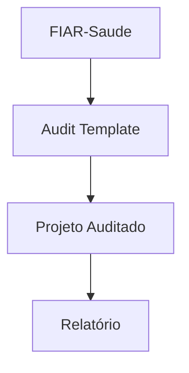
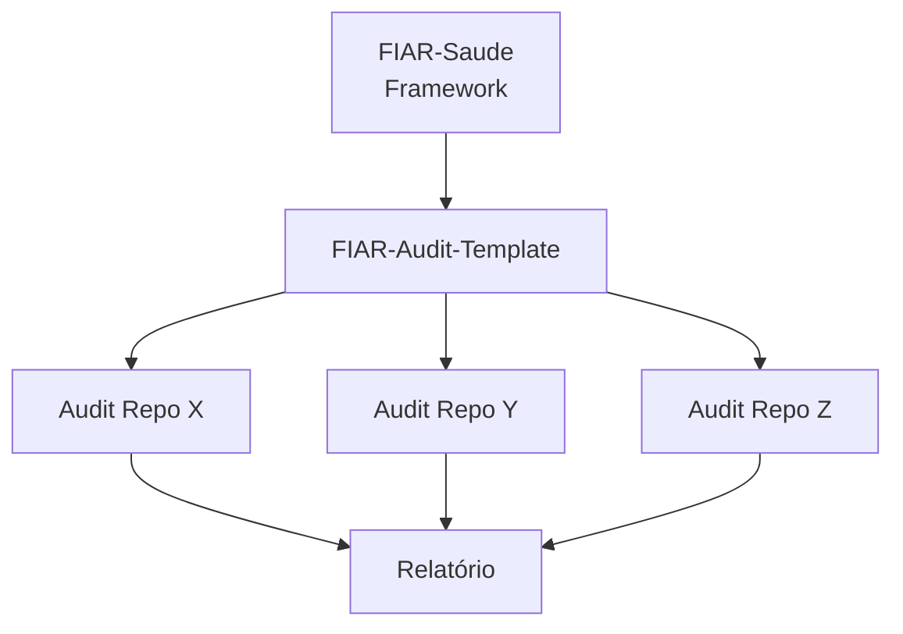

# FIAR Saúde – Framework de Auditoria de IA Responsável


O FIAR Saúde é um framework para auditoria de sistemas de inteligência artificial que transforma princípios de IA Responsável em **critérios verificáveis, evidências documentadas e níveis de maturidade auditáveis**, no contexto da saúde pública.

O framework busca reduzir a lacuna entre **princípios normativos de ética em IA** e sua **operacionalização em práticas de governança e auditoria**, permitindo avaliações sistemáticas, reprodutíveis e comparáveis entre sistemas.

---

## Como funciona?

O FIAR estrutura a auditoria de sistemas de IA como um ecossistema composto por duas camadas complementares:

* **Metodologia** (este repositório)
* **Execução** (template de auditoria)

Para auditar um sistema, utilize o template:

👉 [FIAR Audit Template](https://github.com/marisavas/FIAR-Audit-Template)



A avaliação é realizada por meio de um checklist estruturado, que conecta evidências documentadas a critérios verificáveis e níveis de maturidade.

---

## Dimensões de Avaliação (IAR)

O FIAR operacionaliza a IA Responsável por meio de cinco dimensões críticas:

- **Auditabilidade**: Rastreabilidade do ciclo de vida de dados e modelos (logs, versionamento e controle de acesso)
- **Explicabilidade**: Capacidade de fornecer interpretações compreensíveis para decisões clínicas ou administrativas
- **Justiça**: Detecção e mitigação de vieses em subgrupos demográficos (por exemplo, cor/raça, gênero, região)
- **Privacidade**: Garantia de anonimização e conformidade com a LGPD e normativas do CNS
- **Governança**: Estruturas de decisão, gestão de riscos e alinhamento com comitês de ética (CEP/CONEP)

> As dimensões apresentadas correspondem à **camada técnica da auditoria**.
> A relação com as dimensões institucionais do modelo de maturidade está detalhada em `docs/dimensoes_avaliacao.md`.

As dimensões adotadas refletem categorias amplamente discutidas em diretrizes internacionais, incluindo:

- OECD AI Principles (OECD, 2019)
- WHO Guidance on Ethics and Governance of AI for Health (WHO, 2021)
- ISO/IEC 23894 – AI Risk Management (ISO, 2023)

---

## Níveis de Maturidade

O FIAR classifica o estágio de cada projeto em uma escala progressiva de maturidade:

| Nível       | Estágio               | Descrição                                              |
| ------------ | ---------------------- | -------------------------------------------------------- |
| **L1** | **Ad-hoc**       | Práticas informais e não padronizadas                  |
| **L2** | **Inicial**      | Documentação básica disponível                       |
| **L3** | **Desenvolvido** | Testes técnicos realizados com evidências documentadas |
| **L4** | **Consolidado**  | Monitoramento contínuo e governança integrada          |

---

## Motivação

Frameworks de IA Responsável frequentemente estabelecem princípios éticos de alto nível  como transparência, justiça e responsabilização (*accountability*), mas oferecem orientação limitada sobre sua implementação prática.

Essa lacuna entre **princípios normativos e operacionalização** é amplamente discutida na literatura (Floridi et al., 2018; Morley et al., 2020).

O FIAR propõe uma abordagem operacional baseada em:

* documentação estruturada do sistema
* evidências verificáveis
* avaliação sistemática por dimensões de IA Responsável
* geração de relatórios de auditoria

O framework distingue **artefatos produzidos pelo projeto** de **avaliações independentes conduzidas pelo auditor**, permitindo auditorias mais estruturadas, transparentes e verificáveis e alinhando-se a práticas de auditoria e accountability em sistemas algorítmicos (Raji et al., 2020).

---

## Diferenciais do FIAR

O FIAR se diferencia de outros frameworks de IA Responsável por:

- operacionalizar princípios éticos em **critérios verificáveis**
- separar explicitamente **desenvolvimento do sistema e auditoria independente**
- utilizar **evidências documentadas como base da avaliação**
- adotar um **modelo de maturidade progressivo e cumulativo**
- permitir **reprodutibilidade e rastreabilidade** das auditorias

Essa abordagem responde a críticas recorrentes na literatura sobre a dificuldade de traduzir princípios de IA Responsável em práticas auditáveis e mensuráveis (Mittelstadt, 2019; Raji et al., 2020).

---

## Arquitetura do Framework

O ecossistema FIAR é composto por três elementos principais:

1. **FIAR-Saude** - Documentação conceitual e metodologia
2. **FIAR-Audit-Template** - Estrutura para execução das auditorias
3. **Repositórios de auditoria** – Instâncias específicas para cada sistema avaliado



Cada auditoria deve ser conduzida em um **repositório próprio criado a partir do template**.

---

## Documentação Completa

Para detalhes metodológicos:

- Metodologia → [docs/metodologia_fiar.md](docs/metodologia_fiar.md)
- Ciclo de Auditoria → [docs/ciclo_auditoria.md](docs/ciclo_auditoria.md)
- Dimensões → [docs/dimensoes_avaliacao.md](docs/dimensoes_avaliacao.md)
- Governança → [docs/governanca_auditoria.md](docs/governanca_auditoria.md)

---

## Estrutura do Repositório

```
FIAR-Saude/
├── docs/                       # Detalhamento técnico
│   ├── metodologia_fiar.md     # Fases 1 (Exploratória) e 2 (Sistemática)
│   ├── dimensoes_avaliacao.md  # Critérios e sub-indicadores
│   ├── ciclo_auditoria.md      # Fluxo passo a passo
│   └── governanca_auditoria.md # Papéis e responsabilidades
├── README.md
├── LICENSE
└── CITATION.cff

```

Este repositório contém a **documentação conceitual do framework**. A execução das auditorias deve ser realizada por meio do template.

---

## Exemplo

Um exemplo completo de aplicação do FIAR está disponível em:

👉 [Acessar Toy Example](https://github.com/fiar-audit-toy-example)

Inclui:

* documentação do sistema
* artefatos técnicos
* avaliação estruturada
* relatório final

---

## Quickstart

Para auditar um sistema utilizando o FIAR:

1. Crie um repositório a partir do template
2. Documente o sistema (descrição, contexto, limitações)
3. Adicione artefatos técnicos (Model Card, Data Card, métricas, logs)
4. Avalie o sistema utilizando o checklist FIAR
5. Consolide os resultados por dimensão
6. Gere o relatório de maturidade com recomendações

---

## Público-alvo

O FIAR foi desenvolvido para:

* pesquisadores em IA aplicada à saúde
* equipes de ciência de dados em instituições públicas
* projetos que desejam estruturar práticas de IA Responsável

---

## Status do Projeto

Este framework está em desenvolvimento e validação em projetos de IA em saúde pública no contexto do CIIA-Saúde.

---

## Referência e Citação

Se você utilizar o FIAR em pesquisas ou projetos, cite:

Vasconcelos et al. (2026). *FIAR Saúde – Responsible AI Audit Framework for Public Health Systems.*

---

## Contribuições

Contribuições para o framework são bem-vindas.

---

## Licença

MIT License

---

## Referências


* Floridi, L., et al. (2018). *AI4People—An Ethical Framework for a Good AI Society*. [https://ai4people.org/PDF/AI4People_Ethical_Framework_For_A_Good_AI_Society.pdf](https://ai4people.org/PDF/AI4People_Ethical_Framework_For_A_Good_AI_Society.pdf)
* Morley, J., Machado, C. C., et al. (2020). The ethics of AI in health care: A mapping review. *Social Science & Medicine, 260*, 113172. [https://doi.org/10.1016/j.socscimed.2020.113172](https://doi.org/10.1016/j.socscimed.2020.113172)
* OECD (2019). *OECD Principles on Artificial Intelligence*. [https://legalinstruments.oecd.org/en/instruments/oecd-legal-0449](https://legalinstruments.oecd.org/en/instruments/oecd-legal-0449)
* World Health Organization (WHO). (2021). *Ethics and Governance of Artificial Intelligence for Health*. [https://www.who.int/publications/i/item/9789240029200](https://www.who.int/publications/i/item/9789240029200)
* International Organization for Standardization (ISO). (2023). *ISO/IEC 23894: Artificial intelligence — Risk management*. [https://www.iso.org/standard/77304.html](https://www.iso.org/standard/77304.html)
* National Institute of Standards and Technology (NIST). (2023). *Artificial Intelligence Risk Management Framework (AI RMF 1.0)*. [https://nvlpubs.nist.gov/nistpubs/ai/NIST.AI.100-1.pdf](https://nvlpubs.nist.gov/nistpubs/ai/NIST.AI.100-1.pdf)
* European Union. (2024). *Artificial Intelligence Act*. [https://artificialintelligenceact.eu/](https://artificialintelligenceact.eu/)
* Mittelstadt, B. D., et al. (2019). Principles alone cannot guarantee ethical AI. *Nature Machine Intelligence, 1*, 501–507. [https://doi.org/10.1038/s42256-019-0114-4](https://doi.org/10.1038/s42256-019-0114-4)
* Raji, I. D., et al. (2020). Closing the AI accountability gap: Defining an end-to-end framework for internal algorithmic auditing. In *Proceedings of the 2020 Conference on Fairness, Accountability, and Transparency (FAccT)*. [https://doi.org/10.1145/3351095.3372873](https://doi.org/10.1145/3351095.3372873)
