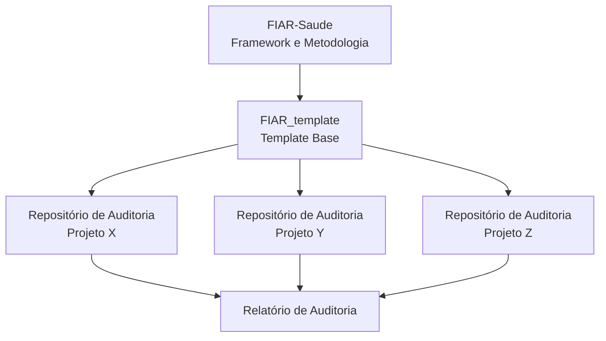

# FIAR-Saúde – Framework de Inteligência Artificial Responsável para Saúde


O FIAR Saúde é um framework metodológico de governança e auditoria de sistemas de inteligência artificial aplicados à saúde. Ele transforma princípios de IA Responsável (IAR) em **critérios verificáveis, evidências documentadas e níveis de maturidade auditáveis**, operando no contexto da saúde pública brasileira.

O framework busca reduzir a lacuna entre **princípios normativos de ética em IA** e sua **operacionalização em práticas de governança e auditoria** — uma limitação amplamente discutida na literatura (Floridi et al., 2018; Mittelstadt, 2019).

> O FIAR-Saúde **não** certifica modelos clínicos, garante ausência de viés ou substitui validação clínica e mecanismos regulatórios formais. Seu foco é a **governança verificável** das práticas associadas ao desenvolvimento, operação e monitoramento de sistemas de IA.

<!-- busca reduzir a lacuna entre **princípios normativos de ética em IA** e sua **operacionalização em práticas de governança e auditoria**, permitindo avaliações sistemáticas, reprodutíveis e comparáveis entre sistemas.-->

---

## Instâncias Institucionais

O FIAR-Saúde opera por meio de duas instâncias institucionais centrais:

- **CIIA-Saúde** (Centro de Inovação em Inteligência Artificial para a Saúde – UFMG): instância decisória, responsável pelo enquadramento institucional dos projetos e validação de aceites de risco residual significativo.
- **NIAR** (Núcleo de Inteligência Artificial Responsável para a Saúde): instância técnico-operacional, conduzindo as fases de capacitação, auditoria e atribuição de maturidade.

---

## Ecossistema

Cada auditoria é conduzida em um **repositório próprio criado a partir do FIAR_template**. O ToyExample é uma instância real de auditoria e referência didática para novos projetos.



| Repositório                         | Função                                                                          |
| ------------------------------------ | --------------------------------------------------------------------------------- |
| **FIAR-Saude** (este)          | Documentação conceitual e metodologia do framework                              |
| **FIAR_template**              | Template base clonado para cada auditoria                                         |
| **Repositórios de auditoria** | Um por projeto auditado — contém artefatos, evidências e consistência cruzada |
| **ToyExample**                 | Instância de auditoria do PrevisãoRESP-SUS usado como exemplo didático         |

---

## Dimensões de IAR

O FIAR-Saúde operacionaliza **sete dimensões** de IA Responsável:

| Dimensão                     | Exemplos de Evidências                                                                      |
| ----------------------------- | -------------------------------------------------------------------------------------------- |
| **Governança**         | Escopo aprovado, condicionantes institucionais, mecanismos de supervisão.                   |
| **Segurança**          | Registros de incidentes, controle de acesso, mecanismos de resposta a falhas.                |
| **Privacidade**         | Documentação sobre anonimização, políticas de retenção, controle de acesso aos dados. |
| **Responsabilização** | Registros nominais de decisão, aprovação formal de riscos.                                |
| **Rastreabilidade**     | Versionamento de dados e modelos, histórico de decisões técnicas.                         |
| **Justiça**            | Métricas de disparidade, avaliações de fairness, registros de mitigação.                |
| **Transparência**      | Relatórios de explicabilidade, justificativas técnicas das decisões de modelagem.         |

---

## Níveis de Maturidade

O nível de maturidade expressa a capacidade institucional do projeto de executar práticas de IAR de forma recorrente e verificável ao longo do tempo. É inferido pelo NIAR a partir do histórico de conformidades das tarefas do projeto.

| Nível       | Denominação | Critério                                                                                              |
| ------------ | ------------- | ------------------------------------------------------------------------------------------------------ |
| **N1** | Ad-hoc        | Ausência de mecanismos estruturados ou execução apenas reativa.                                     |
| **N2** | Inicial       | Pelo menos um ciclo completo de avaliação com artefatos formalmente produzidos.                      |
| **N3** | Desenvolvido  | Recorrência verificável ao longo de múltiplas versões avaliáveis. Exclusivo da Trilha Produção. |
| **N4** | Consolidado   | Monitoramento contínuo institucionalizado e governança integrada. Exclusivo da Trilha Produção.    |

---

## Quickstart

Para auditar um sistema utilizando o FIAR-Saúde:

1. Crie um repositório a partir do **FIAR_template**
2. Defina a **tarefa**: modelo + dados + algoritmo + objetivo clínico/operacional
3. Classifique a tarefa na trilha correspondente (**Artigo** ou **Produção**)
4. Produza os **artefatos de desenvolvimento** (Data Card, Model Card, Fairness Report, Explainability Report, Registro de Decisão Técnica)
5. Submeta ao ciclo de **auditoria do NIAR**
6. Receba a classificação de conformidade e o **nível de maturidade** do projeto

👉 [FIAR_template](https://github.com/niar-saude-ufmg/FIAR-Audit-Template)

---

## Documentação Completa

- Metodologia → [docs/metodologia_fiar.md](https://github.com/niar-saude-ufmg/FIAR-Saude/blob/main/docs/metodologia_fiar.md)
- Ciclo de Auditoria → [docs/ciclo_auditoria.md](https://github.com/niar-saude-ufmg/FIAR-Saude/blob/main/docs/ciclo_auditoria.md)
- Dimensões de IAR → [docs/dimensoes_avaliacao.md](https://github.com/niar-saude-ufmg/FIAR-Saude/blob/main/docs/dimensoes_avaliacao.md)
- Trilhas de Execução → [docs/trilhas_execucao.md](https://github.com/niar-saude-ufmg/FIAR-Saude/blob/main/docs/trilhas_execucao.md)
- Modelo de Maturidade → [docs/modelo_maturidade.md](https://github.com/niar-saude-ufmg/FIAR-Saude/blob/main/docs/modelo_maturidade.md)
- Governança → [docs/governanca_auditoria.md](https://github.com/niar-saude-ufmg/FIAR-Saude/blob/main/docs/governanca_auditoria.md)

---

## Exemplo de Aplicação

👉 [ToyExample — PrevisãoRESP-SUS](https://github.com/niar-saude-ufmg/SBCAS_26_Respiratory_Disease)

Sistema hipotético de previsão de internações respiratórias por hospital utilizando dados do SIH/DataSUS, com avaliação das dimensões de Justiça, Transparência, Auditabilidade e Governança.

---

## Estrutura do Repositório

```
FIAR-Saude/
├── docs/
│   ├── metodologia_fiar.md
│   ├── dimensoes_avaliacao.md
│   ├── ciclo_auditoria.md
│   ├── governanca_auditoria.md
│   ├── trilhas_execucao.md
│   ├── modelo_maturidade.md
│   └── mapeamento_referencias.md
├── README.md
├── LICENSE
└── CITATION.cff
```

---

## Público-alvo

- pesquisadores em IA aplicada à saúde pública
- equipes de ciência de dados em instituições públicas de saúde
- projetos vinculados ao CIIA-Saúde/UFMG
- auditores e gestores responsáveis pela governança de sistemas de IA em saúde

---

## Status

Versão 1.0 — Maio de 2026. Framework em validação em projetos de IA em saúde pública no contexto do CIIA-Saúde/UFMG.

---

## Citação

```
Vasconcelos et al. (2026). FIAR-Saúde: Framework de Inteligência Artificial
Responsável para Saúde. CIIA-Saúde, UFMG / NIAR-Saúde.
```

---

## Licença

MIT License

---

## Referências

* Floridi, L., et al. (2018). [AI4People — An Ethical Framework for a Good AI Society](https://ai4people.org/PDF/AI4People_Ethical_Framework_For_A_Good_AI_Society.pdf).
* Mittelstadt, B. D., et al. (2019). [Principles alone cannot guarantee ethical AI](https://doi.org/10.1038/s42256-019-0114-4). *Nature Machine Intelligence, 1*, 501–507.
* Raji, I. D., et al. (2020). [Closing the AI accountability gap: Defining an end-to-end framework for internal algorithmic auditing](https://doi.org/10.1145/3351095.3372873). In *Proceedings of the 2020 Conference on Fairness, Accountability, and Transparency (FAccT)*.
* Organisation for Economic Co-operation and Development (2024). [Recommendation of the Council on Artificial Intelligence. OECD/LEGAL/0449](https://legalinstruments.oecd.org/en/instruments/oecd-legal-0449).
* World Health Organization (2021). [Ethics and Governance of Artificial Intelligence for Health](https://www.who.int/publications/i/item/9789240029200)
* International Organization for Standardization (2023). [ISO/IEC 23894: Artificial intelligence — Guidance on risk management](https://www.iso.org/standard/77304.html)
* European Union. (2024). [Artificial Intelligence Act](https://artificialintelligenceact.eu/)
* National Institute of Standards and Technology (2023). [Artificial Intelligence Risk Management Framework (AI RMF 1.0)](https://nvlpubs.nist.gov/nistpubs/ai/NIST.AI.100-1.pdf)
* Brasil (2018). Lei nº 13.709 — Lei Geral de Proteção de Dados Pessoais (LGPD).
