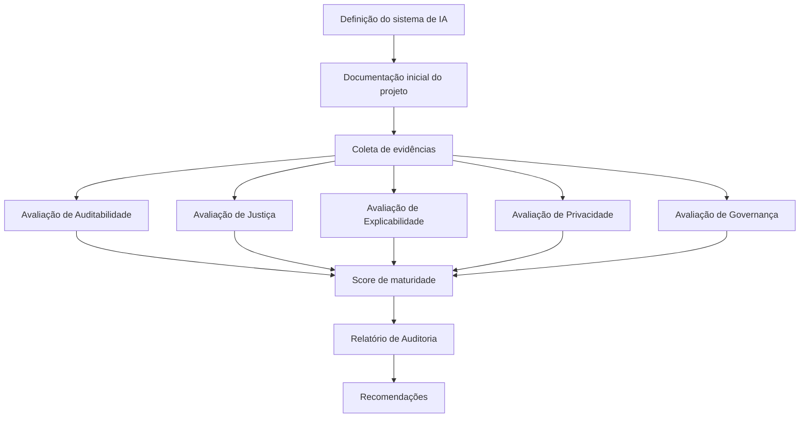

# Ciclo de Auditoria do FIAR

A auditoria de sistemas de inteligência artificial utilizando o FIAR segue um processo estruturado baseado na análise de evidências documentadas.

O ciclo de auditoria foi projetado para garantir **transparência, rastreabilidade e avaliação sistemática** de práticas de IA Responsável.

---

## Etapa 1 – Definição do sistema de IA

A auditoria inicia-se com a definição do sistema de IA a ser avaliado.

Nesta etapa são estabelecidos:

* objetivo do sistema
* contexto de aplicação
* escopo da auditoria
* equipe responsável pelo projeto

Essa definição delimita o escopo da avaliação e permite identificar riscos iniciais associados ao sistema.

---

## Etapa 2 – Documentação inicial do projeto

A equipe responsável pelo sistema de IA produz uma documentação inicial contendo informações relevantes sobre o projeto.

Essa documentação inclui, quando disponível:

* descrição do sistema
* contexto de aplicação
* fontes de dados
* arquitetura do modelo
* limitações conhecidas

Essa etapa fornece o contexto necessário para a condução da auditoria.

---

## Etapa 3 – Produção de artefatos técnicos

O projeto produz artefatos técnicos que documentam aspectos específicos do sistema de IA.

Entre os principais artefatos estão:

* **Data Cards**, descrevendo características dos dados utilizados
* **Model Cards**, documentando propriedades do modelo
* **Relatórios técnicos**, descrevendo avaliações realizadas pelo projeto

Esses artefatos constituem a base de evidências para a avaliação.

---

## Etapa 4 – Coleta e organização de evidências

O auditor analisa a documentação e os artefatos produzidos pelo projeto.

Essa etapa envolve:

* revisão da documentação do sistema
* análise de artefatos técnicos
* mapeamento das evidências às dimensões de avaliação

A coleta e organização de evidências estruturam a base analítica da auditoria.

---

## Etapa 5 – Avaliação

O auditor conduz a avaliação do sistema com base nas dimensões definidas pelo FIAR:

* auditabilidade
* explicabilidade
* justiça
* privacidade
* governança

A avaliação é operacionalizada por meio de um **checklist estruturado**, que associa:

- dimensões de IA Responsável
- critérios verificáveis
- evidências documentadas

Cada item do checklist é classificado como:

- presente
- parcial
- ausente

Os resultados são agregados por dimensão e utilizados para determinar o nível de maturidade do sistema (L1–L4).

Para critérios detalhados por dimensão, consulte:

→ [Dimensões de Avaliação](dimensoes_avaliacao.md)

---

## Etapa 6 – Relatório de auditoria

Ao final do processo, o auditor produz um relatório estruturado contendo:

* avaliação por dimensão
* evidências analisadas
* justificativas da avaliação
* recomendações para melhoria

O relatório tem como objetivo apoiar **governança, transparência e melhoria contínua** de sistemas de IA.

---

## Representação do Ciclo de Auditoria

---

## Síntese do Processo

O fluxo apresentado pode ser consolidado em três fases principais, que estruturam a auditoria de forma progressiva:

1. **Documentação do sistema**

2. **Avaliação por dimensões de IA Responsável**

3. **Relatório de auditoria e recomendações**

Essa síntese apresenta o ciclo de auditoria em um nível mais abstrato, facilitando sua aplicação em diferentes contextos e tipos de sistema.

---

## Relação com a metodologia

O ciclo de auditoria operacionaliza os princípios definidos na metodologia do framework, especialmente no que se refere ao uso de evidências documentadas e à separação entre projeto e avaliação independente.

Para uma visão conceitual do framework, consulte:
→ [Metodologia do FIAR](metodologia_fiar.md)

Para o detalhamento dos critérios de avaliação por dimensão:
→ [Dimensões de IA Responsável](dimensoes_avaliacao.md)

Para documentação específica de cada dimensão: 
→ [Documentação detalhada por dimensão](avaliacao/)

## Hierarquia de navegação

A documentação do FIAR está organizada em três níveis complementares:

1. **Metodologia** – visão conceitual do framework  
2. **Dimensões** – estrutura de avaliação  
3. **Avaliação** – critérios detalhados por dimensão  

Essa organização permite diferentes formas de navegação:

- Para uma visão conceitual do framework → consulte a metodologia  
- Para entender o que é avaliado → consulte as dimensões  
- Para critérios detalhados de avaliação → consulte a documentação de avaliação  
